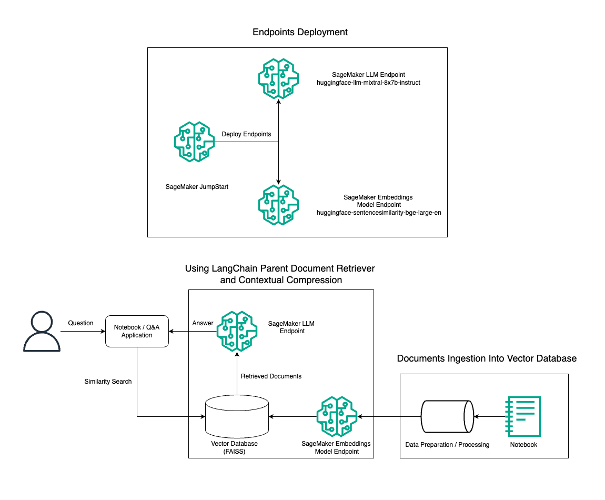
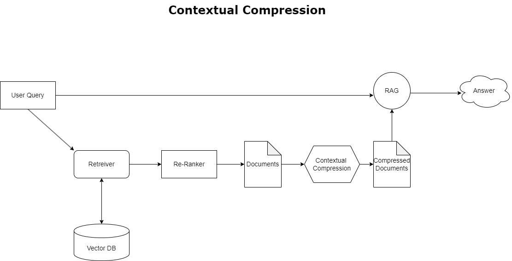
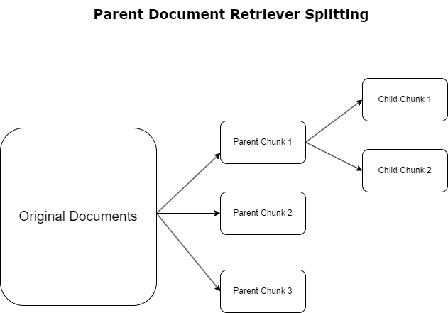

# Advanced RAG Patterns with Mixtral on SageMaker Jumpstart

Example Jupyter Notebook of [Mixtral 8x7B Instruct](https://huggingface.co/mistralai/Mixtral-8x7B-Instruct-v0.1) and [BGE Large En](https://huggingface.co/BAAI/bge-large-en) to experiment Advanced Retrieval Augmented Generation (RAG) QnA systems on a SageMaker Notebook using [LangChain](https://www.langchain.com/).

See the accompanying blog post on the [AWS Machine Learning Blog](https://aws.amazon.com/blogs/machine-learning/advanced-rag-patterns-on-amazon-sagemaker/) for a detailed description.

## :books: Background

[Amazon SageMaker](https://aws.amazon.com/sagemaker/) is a fully managed service for data science and machine learning (ML) workflows.
You can use Amazon SageMaker to simplify the process of building, training, and deploying ML models.

The [SageMaker example notebooks](https://sagemaker-examples.readthedocs.io/en/latest/) are Jupyter notebooks that demonstrate the usage of Amazon SageMaker.

The [Sagemaker Example Community repository](https://github.com/aws/amazon-sagemaker-examples-community) are additional notebooks, beyond those critical for showcasing key SageMaker functionality, can be shared and explored by the commmunity.

## Prerequisites

### Sagemaker Prerequisites

In this section, you sign up for an AWS account and create an AWS Identity and Access Management (IAM) admin user.

If you're new to SageMaker, we recommend that you read [What is Amazon SageMaker?](https://docs.aws.amazon.com/sagemaker/latest/dg/whatis.html).

Follow the hyperlinks below to finish setting up the prerequisites for Sagemaker

-   [Create an AWS Account](https://docs.aws.amazon.com/sagemaker/latest/dg/gs-set-up.html#gs-account) - This walks you through setting up an AWS account
-   When you create an AWS account, you get a single sign-in identity that has complete access to all of the AWS services and resources in the account. This identity is called the AWS account root user.
-   Signing in to the AWS console using the email address and password that you used to create the account gives you complete access to all of the AWS resources in your account. We strongly recommend that you not use the root user for everyday tasks, even the administrative ones.
-   Instead, adhere to the Security best practices in [IAM](https://docs.aws.amazon.com/sagemaker/latest/dg/security-iam.html), and [Create an Administrative User and Group](https://docs.aws.amazon.com/sagemaker/latest/dg/gs-set-up.html#gs-account-user). Then securely lock away the root user credentials and use them to perform only a few account and service management tasks.
  

Once you are done with the above steps, you can move on to the one below

- The Mixtral 8x7b model requires an ml.g5.48xlarge instance. Amazon SageMaker JumpStart provides a simplified way to access and deploy over 100 different open source and third-party foundation models. In order to [launch an endpoint to host Mixtral 8x7B from SageMaker JumpStart](https://docs.aws.amazon.com/sagemaker/latest/dg/jumpstart-deploy.html), you may need to request a service quota increase to access an ml.g5.48xlarge instance for endpoint usage. You can easily [request service quota increases](https://docs.aws.amazon.com/servicequotas/latest/userguide/request-quota-increase.html) through the AWS console, CLI, or API to allow access to those additional resources.
  
## Architecture

## Solution

In this repo we deploy a notebook, explain, and demonstrate the use of Mixtral 8x7B Instruct text generation combined with  [BGE Large En](https://huggingface.co/BAAI/bge-large-en) embedding model to efficiently construct a Retrieval Augmented Generation (RAG) QnA system on a [SageMaker](https://www.googleadservices.com/pagead/aclk?sa=L&ai=DChcSEwjC_smL6eSEAxUEaEcBHZKoCSwYABAAGgJxdQ&ase=2&gclid=CjwKCAiAi6uvBhADEiwAWiyRdm9fVXFJASMNG1LKo8hiUv7jEdUGhQ51tmCA-DngfHXsGDxLTBupFxoCvOcQAvD_BwE&ohost=www.google.com&cid=CAESVuD21B3o9zHMrlIQeG15m__r93DdZcVN4-3nXJ8u-dbMgnV5nBVFDPVOeevCZP5QgBP14_Qeor3zFwnOSibAEKrO6aqVYLSUyGSmJPwkoSC1y-dk0RNh&sig=AOD64_1g7baA79iO0oQhm2pU4_You-GQgQ&q&nis=4&adurl&ved=2ahUKEwjqhL-L6eSEAxUqD1kFHbRFAUEQ0Qx6BAgHEAE) Notebook using the Parent Document Retriever tool and Contextual Compression technique. This solution can be deployed with just a few clicks using [SageMaker JumpStart](https://aws.amazon.com/sagemaker/jumpstart/), a fully-managed platform that offers state-of-the-art foundation models for various use cases such as content writing, code generation, question answering, copywriting, summarization, classification, and information retrieval. It provides a collection of pre-trained models that can be deployed quickly and easily, accelerating the development and deployment of machine learning applications. One of the key components of SageMaker Jumpstart is the Model Hub, which offers a vast catalog of pre-trained models such as the Mixtral 8x7B for a variety of tasks.

The Jupyter notebook for this solution is in [Sagemaker-Advanced-RAG-langchain](https://github.com/aws-samples/advanced-rag-patterns-on-mixtral/blob/main/notebooks/sagemaker-advanced-rag-langchain.ipynb) 

## Parent Document Retriever Workflow

## Contextual Compression Workflow

## :hammer_and_wrench: Setup

The quickest setup to run example notebooks includes:
- An [AWS account](http://docs.aws.amazon.com/sagemaker/latest/dg/gs-account.html)
- Proper [IAM User and Role](http://docs.aws.amazon.com/sagemaker/latest/dg/authentication-and-access-control.html) setup
- An [Amazon SageMaker Notebook Instance](http://docs.aws.amazon.com/sagemaker/latest/dg/gs-setup-working-env.html)

## Contributing

For any specific questions on how to contribute, please contact [armdiazg@amazon.com](https://www.linkedin.com/in/armando-diaz-47a498113/), [vijeasns@amazon.com](https://www.linkedin.com/in/niithiyn-vijeaswaran-451245213/), [bustils@amazon.com](https://www.linkedin.com/in/sebastian-bustillo/), [puniomp@amazon.com](https://www.linkedin.com/in/marcpunio/), [farsabir@amazon.com](https://www.linkedin.com/in/farooqsabir/), and [aboujid@amazon.com](https://www.linkedin.com/in/aj-dhimine-34a8b01ba/).

We welcome community contributions! Please see [CONTRIBUTING.md](CONTRIBUTING.md) for guidelines.

## Security

See [CONTRIBUTING](CONTRIBUTING.md#security-issue-notifications) for more information.

## License

This library is licensed under the MIT-0 License. See the [LICENSE](LICENSE) file.
